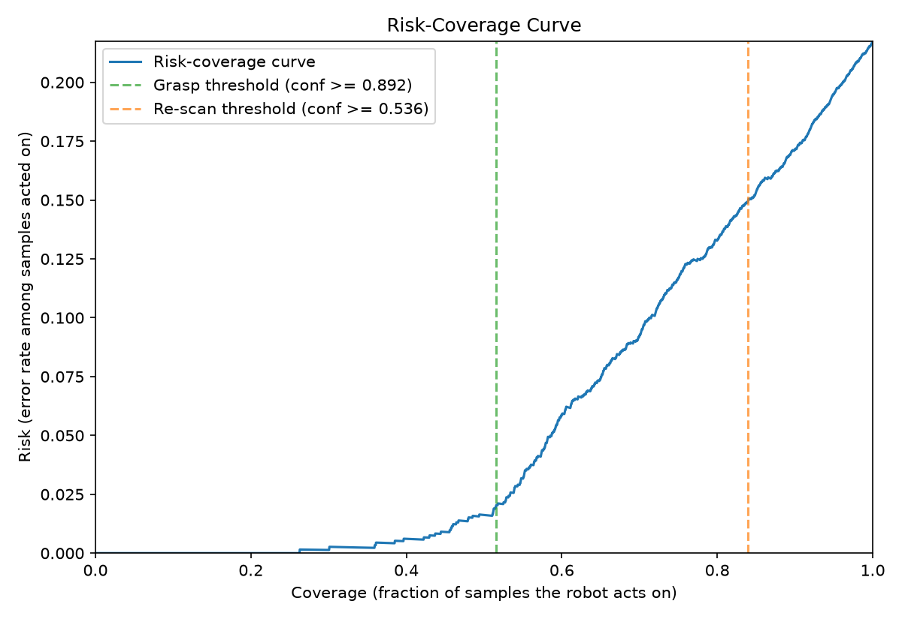
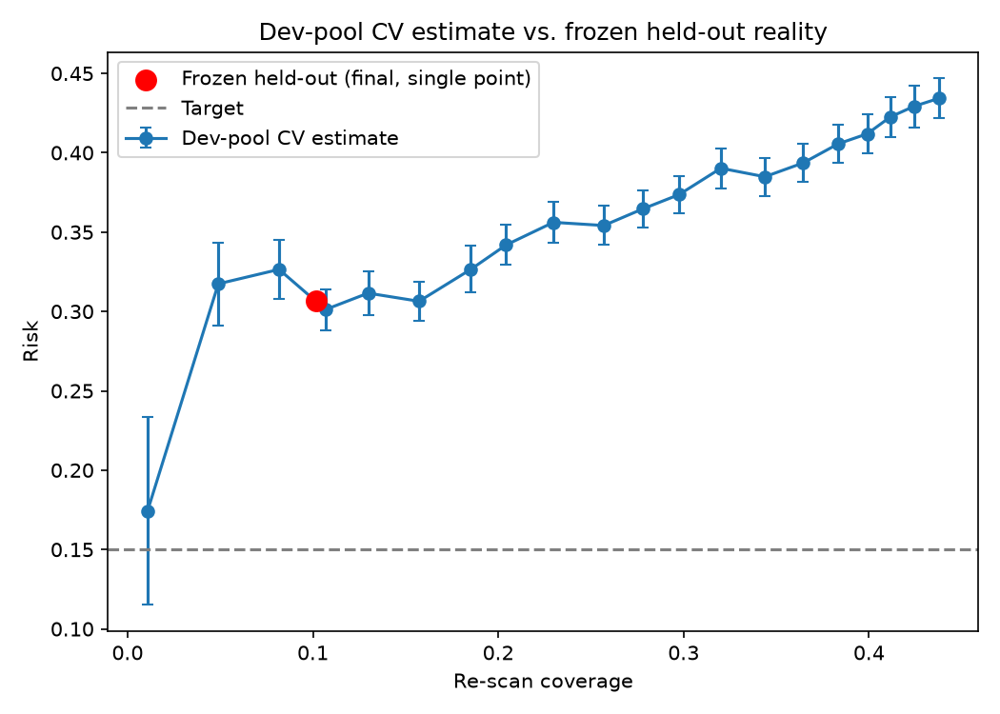
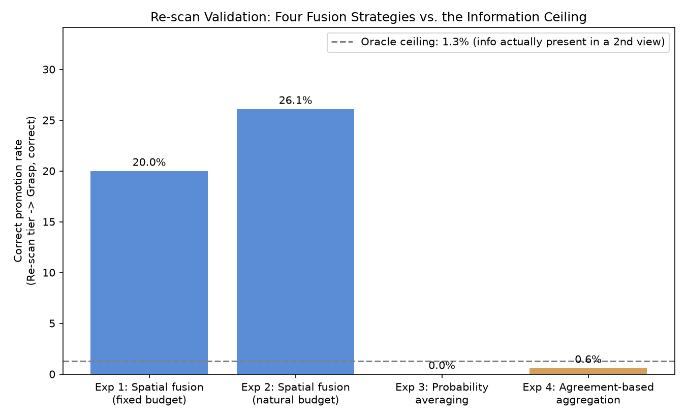
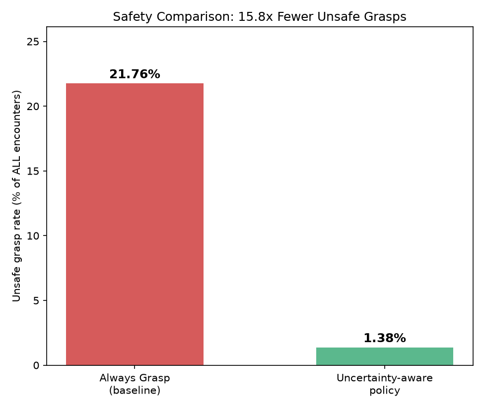

# Uncertainty-Aware PointNet for Safe Robotic Grasping — Progress Report

*Status: core experimental pipeline complete through the decision-policy stage. ROS2/simulated-grasping integration and full manuscript writing remain outstanding.*

---

## 1. Problem Statement and Contribution

PointNet-style point cloud classifiers produce a softmax distribution over classes but do not natively express whether a given prediction should be trusted. A softmax output is a normalized probability vector, not a calibrated confidence estimate, and the network will produce a full-confidence prediction even for degraded, incomplete, or entirely out-of-distribution (OOD) inputs. In a robotic grasping context, this is a safety-relevant failure mode: a misclassification acted upon with high confidence can result in an unsafe or incorrect grasp attempt.

This project investigates whether Monte Carlo (MC) Dropout can provide useful uncertainty estimates for PointNet under semantic OOD and sensor-corruption conditions, characterizes where different uncertainty signals succeed and fail, and uses the resulting confidence information to construct a risk-controlled action policy (Grasp / Re-scan / Ask-for-help). The contribution is not a claim that MC Dropout universally outperforms softmax confidence as an uncertainty estimator; several results below indicate it does not, in this configuration. The contribution is a characterization of *when* and *why* it does or does not help, and a decision-policy framework — with an explicit, tested methodology for deriving thresholds — that a downstream system could use regardless of which uncertainty signal proves most reliable in a given setting.

---

## 2. Dataset and Experimental Setup

**Dataset:** ModelNet40, using the standard pre-sampled point-cloud release (train/test split as provided; no independent validation split is shipped, so one is constructed here).

**Point sampling:** each object is subsampled to $N = 1024$ points, consistent with the original PointNet classification benchmark.

**Splits:**

| Split | Count | Construction |
|---|---|---|
| Train | 8,163 | 90% of the official train split (stratified, seed = 42) |
| Validation | 905 | Remaining 10% of the official train split |
| Test (in-distribution) | 2,288 | Official test split |
| OOD (held out) | 180 | Objects from 5 classes excluded entirely from train/validation |

**OOD class selection:** `bottle`, `bowl`, `cup`, `keyboard`, `laptop`. These were excluded from training and validation entirely and are used only for out-of-distribution evaluation. The classes were chosen to represent plausible robotic-grasping targets with varied geometry (round/hollow, flat, irregular), rather than being selected post hoc based on model behavior.

**Label handling:** original ModelNet40 class indices are remapped to a contiguous range for the 35 active (non-OOD) classes prior to training, to avoid invalid target indices in the classification head.

---

## 3. Model Architecture

The implementation follows the original PointNet classification architecture (Qi et al., 2017), omitting the segmentation branch (not required for this task):

$$
\text{Input } (N \times 3) \;\rightarrow\; T\text{-Net}_{3\times3} \;\rightarrow\; \text{MLP}_{64} \;\rightarrow\; T\text{-Net}_{64\times64} \;\rightarrow\; \text{MLP}_{64,128,1024} \;\rightarrow\; \max\text{-pool} \;\rightarrow\; \text{FC}_{512,256} \;\rightarrow\; \text{softmax}
$$

**Permutation invariance.** A point cloud is an unordered set $\{p_1, \dots, p_N\}$. PointNet achieves invariance to point ordering by applying a shared function $h$ independently to every point and aggregating with a symmetric function:

$$
f(\{p_1, \dots, p_N\}) \approx \gamma\Big(\max_{i=1,\dots,N} h(p_i)\Big)
$$

Because $\max$ is symmetric, this construction is provably invariant to any permutation of the input points — the network's output does not depend on the order in which points are provided.

**Loss function.** Standard cross-entropy plus an orthogonality regularization on the learned $64\times64$ feature-alignment matrix $A$, encouraging it to behave as a near-rotation rather than a lossy projection:

$$
\mathcal{L} = \mathcal{L}_{\text{CE}}(y, \hat{y}) + \lambda \, \lVert I - AA^\top \rVert_F^2, \qquad \lambda = 0.001
$$

**Parameter count:** 3,470,188 trainable parameters, matching the ≈3.5M reported in the original paper — used as a sanity check that the implementation is a faithful reproduction rather than a reduced variant.

**MC Dropout compatibility.** Dropout layers ($p=0.3$ in the initial baseline; varied in the ablation, Section 7) are retained active at inference time rather than disabled, which is the only architectural requirement for the uncertainty method in Section 5. No other architectural change was needed.

---

## 4. Baseline Training

100 epochs, Adam ($\text{lr}=10^{-3}$, weight decay $10^{-4}$), step decay ($\times 0.5$ every 20 epochs), batch size 32. Validation accuracy reached within 1 percentage point of its final best value by epoch 61 (best occurred at epoch 93).

| Metric | Value |
|---|---|
| Best validation accuracy | 86.08% |
| Test accuracy | 82.82% |
| Test macro precision / recall / F1 | 0.740 / 0.748 / 0.739 |

The original paper reports ≈89% on the full 40-class dataset; the 35-class result here (5 classes withheld for OOD evaluation, no hyperparameter search) is consistent with a correct implementation rather than a degraded one.

---

## 5. Uncertainty Estimation via MC Dropout

Following Gal & Ghahramani (2016), leaving dropout active at inference time and performing $T$ stochastic forward passes on the same input approximates variational inference in a Bayesian neural network, without the cost of an exact Bayesian treatment. For $T=30$ passes producing softmax outputs $p_1, \dots, p_T$:

**Predictive mean:**
$$
\bar{p}(y=k \mid x) = \frac{1}{T}\sum_{t=1}^{T} p_t(y=k \mid x)
$$

**Total predictive entropy** (overall uncertainty in the averaged prediction):
$$
H[y \mid x] = -\sum_k \bar{p}(y=k\mid x)\log \bar{p}(y=k \mid x)
$$

**Aleatoric uncertainty** (average uncertainty within each individual pass — uncertainty attributable to the input itself):
$$
\mathbb{E}_t\big[H[y \mid x, W_t]\big] = \frac{1}{T}\sum_{t=1}^{T} \Big(-\sum_k p_t(y=k\mid x)\log p_t(y=k\mid x)\Big)
$$

**Epistemic uncertainty** (BALD mutual information — the portion of total uncertainty attributable to disagreement between passes, i.e. model-level ignorance):
$$
I[y, W \mid x] = H[y\mid x] - \mathbb{E}_t\big[H[y\mid x, W_t]\big]
$$

---

## 6. Calibration and OOD Detection

**Calibration.** Expected Calibration Error (ECE) partitions predictions into confidence bins and compares mean confidence against empirical accuracy per bin:

$$
\text{ECE} = \sum_{b=1}^{B} \frac{n_b}{n} \left| \text{acc}(b) - \text{conf}(b) \right|
$$

Baseline model (dropout = 0.3): **ECE = 0.0145** — within the conventional well-calibrated range (< 0.05–0.10).


**OOD detection.** AUROC of separating in-distribution test samples from OOD samples using each uncertainty signal as a ranking score:

| Signal | AUROC |
|---|---|
| Confidence | 0.729 |
| Aleatoric | 0.714 |
| Total entropy | 0.713 |
| Epistemic | 0.674 |

Softmax confidence outperformed the epistemic uncertainty signal at this operating point. This does not indicate that MC Dropout provides no value — the decision policy (Section 9) still relies on the mean-prediction confidence that MC Dropout produces, which differs from single-pass softmax confidence and benefits from the averaging over stochastic passes — but it does indicate that the specific epistemic decomposition was not the most informative individual signal for OOD discrimination in this configuration.

---

## 7. Robustness to Corruption

Accuracy, mean confidence, and mean predictive entropy were measured under independently increasing Gaussian coordinate noise and simulated single-viewpoint occlusion (points beyond a random cutting plane removed, then resampled to maintain $N=1024$), using the same trained checkpoint with no retraining.


Mean confidence remained close to accuracy through moderate noise levels, which suggests calibration may remain reasonably stable under mild covariate shift; formal per-severity ECE was not computed and would be needed to state this more rigorously. A confidence–accuracy gap opened at higher noise severity ($\sigma = 0.10$: confidence 0.580 vs. accuracy 0.299).


Under occlusion, the confidence–accuracy gap is substantially larger: at 60–80% occlusion, accuracy falls to near-floor levels (6.3% and 1.5% respectively) while mean confidence remains at 0.53–0.59. This indicates that, for this corruption type, the model's confidence does not track its actual reliability, which is the specific failure mode motivating the project's decision-policy layer.

---

## 8. Ablation Studies

### 8.1 Number of MC Passes

$T \in \{5, 10, 20, 30, 50\}$ evaluated on the fixed baseline checkpoint (inference only, no retraining).


Accuracy, ECE, and OOD-AUROC were effectively flat across this range (accuracy varied by < 1 point, AUROC by < 2 points), while inference time scaled linearly with $T$. Increasing the number of MC samples from 5 to 50 did not materially improve epistemic OOD discrimination, suggesting that the weak epistemic signal observed in Section 6 was not primarily caused by insufficient MC sampling.

### 8.2 Dropout Rate

The model was retrained at four dropout rates (0.1, 0.3, 0.5, 0.7; 100 epochs each) to test the hypothesis that a higher dropout rate would increase informative stochastic variation between MC samples and thereby improve epistemic OOD discrimination.

| Dropout | Test Acc | ECE | AUROC (confidence) | AUROC (epistemic) |
|---|---|---|---|---|
| 0.1 | 0.844 | 0.0299 | 0.735 | 0.705 |
| 0.3 | 0.828 | 0.0145 | 0.729 | 0.674 |
| 0.5 | 0.816 | 0.0157 | 0.678 | 0.665 |
| 0.7 | 0.808 | 0.0168 | 0.673 | 0.626 |

*(Individual reliability diagrams: [p=0.1](experiments/dropout_ablation_p0.1_20260903_140728/reliability_diagram.png), [p=0.5](experiments/dropout_ablation_p0.5_20260903_150201/reliability_diagram.png), [p=0.7](experiments/dropout_ablation_p0.7_20260903_155453/reliability_diagram.png))*

The ablation falsified the initial hypothesis: higher dropout increased stochastic perturbation between passes but did not make that variation more informative for distinguishing ID from OOD samples. Both accuracy and every OOD-detection signal degraded monotonically as dropout increased from 0.1 to 0.7. The T-ablation result (8.1) suggests this weakness is not attributable to insufficient sampling; dropout rate is one plausible contributing factor among several (architecture, dropout placement, and the specific uncertainty decomposition used could also contribute), and this ablation does not isolate which.

**Model selection.** Among the tested configurations, dropout = 0.1 provided the best combination of classification accuracy and OOD discrimination while maintaining an acceptable (if comparatively weaker) calibration error, and was selected for the downstream decision-policy experiments in Section 9.

---

## 9. Decision Policy

### 9.1 Formalism

The policy follows a selective classification framework: rather than acting on every input, the system may abstain on low-confidence inputs. **Coverage** is the fraction of encounters on which the system is permitted to act; **risk** is the error rate among the encounters accepted at a given confidence threshold $\tau$:

$$
\text{coverage}(\tau) = \frac{|\{x : \text{conf}(x) \ge \tau\}|}{n}, \qquad
\text{risk}(\tau) = \frac{1}{|\{x : \text{conf}(x)\ge\tau\}|}\sum_{x:\,\text{conf}(x)\ge\tau} \mathbb{1}[\text{error}(x)]
$$

Sweeping $\tau$ traces the risk–coverage curve. Evaluation combines the in-distribution test set and the OOD set, since a deployed system encounters both; for the safety policy, an OOD object reaching the grasp tier is treated as an error regardless of its predicted known class, because the classifier was never trained to recognize that OOD category and the policy is intended to reject objects outside its known vocabulary.

Threshold selection targets the highest-coverage operating point subject to a risk constraint, i.e. $\max \text{coverage}(\tau)$ subject to $\text{risk}(\tau) \le \tau_{\text{target}}$, rather than the threshold whose risk is merely numerically closest to the target — these are different objectives, and only the former is appropriate for maximizing usable coverage under a safety constraint.

### 9.2 Methodological Issue Identified and Corrected

An initial threshold-selection procedure searched over all unique confidence values ($\approx$1,234 candidates) within a single evaluation split and selected the value achieving the target in-sample risk. This produced a Grasp threshold ($\tau \ge 0.892$) with a small, stable generalization gap, but a Re-scan threshold ($\tau \ge 0.536$) with in-sample risk of 15.00% that generalized to 36.07% (mean over 20 independent random splits, std 2.14%, range 32.6–41.0%) when evaluated on data disjoint from the selection sample. This gap is retained here as a substantive finding rather than discarded, since it directly motivated the corrected procedure below and is itself informative about the risks of unconstrained threshold search on limited data (only 180 OOD samples are available in total).



**Corrected procedure.** All 2,468 test+OOD samples were split once into a policy-development pool (65%, seed = 42) and a frozen held-out evaluation pool (35%), the latter untouched until threshold selection was complete. Within the development pool only, a fixed grid of 20 candidate thresholds was evaluated via repeated bootstrap resampling (25 resamples per candidate) to obtain a cross-validated risk estimate per candidate, with a minimum-coverage constraint (≥10%) imposed to prevent the selection from degenerating toward a near-empty, noise-dominated tier. The selected threshold was then applied exactly once to the frozen pool.

This design distinguishes two competing explanations for the original instability: if the frozen held-out risk closely matches the development-pool cross-validated estimate, the original volatility was substantially a threshold-selection overfitting artifact; if a large gap persists even under this stricter procedure, confidence genuinely cannot reliably control risk in that region regardless of selection method.



**Result:** development-pool CV estimate 30.12% (± 1.29% across resamples); frozen held-out risk 30.68% — a gap of 0.56 percentage points. This is consistent with the first explanation for the *volatility* of the original estimate (the 15%→36% swing was substantially a selection artifact, and the corrected procedure is reproducible), but it also establishes that the *achievable* risk for a re-scan tier of meaningful size (≥10% coverage) is approximately 30%, not the originally targeted 15%. The 15% target was not attainable for this tier with confidence as the selection signal, independent of how the threshold was chosen.

### 9.3 Final Policy

| Tier | Threshold | Coverage | Risk (frozen held-out) |
|---|---|---|---|
| Grasp | confidence ≥ 0.877 | 51.4% | 3.83% |
| Re-scan | confidence ≥ 0.777 | 10.2% | 30.68% |
| Ask for help | below 0.777 | 38.4% | 46.39% |

On this held-out evaluation, 12.7% of OOD objects were routed to the Grasp tier. On our 180-object held-out OOD evaluation set considered as a whole (Section 9.2's data), a comparable fraction of OOD objects reached the grasp tier across the several evaluation procedures tested (ranging 5.0–12.7% depending on the specific held-out split); the policy therefore reduces, but does not eliminate, OOD objects being accepted for autonomous action. On our evaluation set, the grasp tier defined by confidence ≥0.877 had an empirical risk of 3.83%; this describes performance on the evaluation data used and should not be read as a guaranteed deployment risk without further validation on independent data or hardware.

### 9.4 Analysis of Grasp-Tier Failures

Samples reaching the Grasp tier despite being OOD were inspected directly rather than only summarized numerically. All such failures in the analyzed set were concentrated in a single confusion pattern: bottle and cup objects classified as vase (7 and 2 instances respectively, of 9 total). This suggests a systematic geometric confusion among visually and structurally similar container-like shapes (tall, narrow, hollow), although the exact causal features (e.g. aspect ratio, opening diameter) would require further analysis to confirm.

---

### 9.5 Validating the Re-scan Premise: Multi-View Fusion Experiments

Section 10 (Limitations, prior draft) identified that the Re-scan tier's underlying premise — that an additional observation improves outcomes for medium-confidence cases — had not been experimentally validated. Four experiments were conducted to test this directly, using independently generated partial viewpoints of each object (random-direction visibility masks over the full-resolution point cloud, not merely re-sampled duplicates of a single occluded view).

**Experiment 1 — naive spatial point-cloud fusion (fixed budget).** The union of two independent partial views was compressed back to 1024 points (matching the original single-view budget). Result: 20.0% of Re-scan-tier cases were correctly promoted to Grasp; 66.7% of promotions were correct.

**Experiment 2 — naive spatial fusion (natural budget).** Correcting a methodological flaw in Experiment 1 — a real second scan adds points rather than compressing back to the original budget — the fused cloud was allowed to retain its natural, larger point count. Result: 26.1% correct promotion rate; 85.7% of promotions correct. This confirms the fixed-budget design in Experiment 1 was suppressing performance, but fusion still left the majority of Re-scan cases unresolved (52.2% moved to Ask-for-help rather than Grasp).

**Experiment 3 — probability-distribution averaging.** To eliminate any risk of feeding the network unfamiliar point-cloud geometry, each scan was kept as an independent, normally-formatted 1024-point view, and the resulting MC Dropout mean probability distributions were averaged across scans (a standard multi-view ensembling approach). Result: 0.0% correct promotion across 24 Re-scan cases; mean confidence *decreased* monotonically with additional scans (0.821 → 0.535 → 0.434 for k=1,2,3). This is a predictable consequence of averaging distributions that disagree on the top class — when different occluded views point toward different classes, averaging necessarily flattens the resulting distribution rather than sharpening it.

**Experiment 4 — oracle diagnostic and agreement-based aggregation (full dataset, N=164 Re-scan cases).** To distinguish "the information exists but aggregation destroys it" from "the information is not present," each individual additional scan was checked independently for whether it alone reached Grasp-level confidence with a correct prediction. Only **1.3%** of in-distribution Re-scan cases (2 of 157) had any additional scan meeting this bar. An agreement-based aggregation rule (commit to a class only when a majority of scans agree; treat disagreement as maximal uncertainty rather than averaging through it) was also tested and performed comparably poorly (0.6% correct promotion rate).

**Conclusion.** The oracle result is decisive: for the substantial majority of Re-scan-tier cases under this occlusion model, a second independently-occluded view does not contain the distinguishing information needed to resolve the ambiguity, regardless of how observations are combined. This is not an aggregation-algorithm failure — the same conclusion held across four different combination strategies — but a property of the occlusion model itself: when the identifying geometric features of an object are removed by occlusion, a second random partial view frequently fails to reveal them.



**The Re-scan action, as currently designed, should not be assumed to reduce risk**, and would require either a smarter view-selection strategy (e.g. an active-vision approach that deliberately seeks out the specific missing information, rather than an arbitrary second random viewpoint) or an acknowledgment that, under this occlusion model, "ask for help" is the more honest fallback for these cases than "re-scan."

### 9.6 System-Level Safety Comparison

The central practical question — does the uncertainty-aware policy actually reduce unsafe autonomous actions relative to a naive system — was evaluated directly. **Unsafe grasp rate** is defined as the fraction of *all* encounters resulting in an incorrect autonomous grasp; Re-scan and Ask-help outcomes are excluded from this count regardless of their own error rate, since neither results in an autonomous grasp attempt.

| Policy | Unsafe grasp rate (of all 2,468 encounters) |
|---|---|
| Baseline: always grasp, ignore confidence | 21.76% |
| Uncertainty-aware policy (Grasp/Re-scan/Ask-help) | **1.38%** |



This is a **15.8x reduction** in unsafe autonomous grasps (20.38 percentage points, absolute), at the cost of autonomously resolving only 53.5% of encounters — the remaining 46.5% are deferred to re-scanning (10.5%) or human assistance (36.0%) rather than acted on directly. This is the central quantified result of the project: the uncertainty-aware policy provides a substantial, measured safety improvement over naive always-grasp behavior, even though (Section 9.5) the specific Re-scan mitigation does not yet demonstrably improve outcomes on its own.

---

## 10. Limitations


- **Re-scan tier risk (≈30%) exceeds the originally targeted 15%.** This was established as a genuine limitation of confidence as a selection signal for this coverage regime (Section 9.2), not an artifact of an insufficiently careful search.
- **OOD sample size is small** (180 total, ≤117 in any single development pool). Point estimates for OOD-specific metrics (e.g. leakage percentage) carry non-trivial variance; a single repeated-split analysis found a standard deviation of 3.93 percentage points on OOD leakage across 20 resamples.
- **The Re-scan action does not currently improve outcomes.** Section 9.5 tested this directly across four independent fusion/aggregation strategies; an oracle analysis found the distinguishing information needed to resolve Re-scan-tier ambiguity is present in an additional random viewpoint in only 1.3% of cases. Re-scan, as currently implemented (an arbitrary second random partial view), is not a validated risk-reduction mechanism and should not be presented as one without either an active-vision view-selection strategy or further evidence.
- **Robotic grasping safety has not been physically or even simulation-demonstrated.** This project investigates whether MC Dropout provides useful uncertainty information for PointNet under OOD and corruption conditions; robotic grasping is the motivating application, and the ROS2/simulated-grasping integration (planned, not yet built) would be required before any claim about actual grasping safety.
- **Formal per-severity calibration under corruption was not computed** (Section 7 discusses confidence–accuracy tracking qualitatively; ECE at each corruption severity was not measured).

---

## 11. Remaining Work

- [ ] Lightweight ROS2 demo for presentation purposes (not a full grasping system — the core scientific claims are validated without it; this is a visualization/demo layer).
- [ ] Manuscript writing.

---

## 12. Repository Structure

```
src/
├── data/          # dataset loading, train/val/test/OOD splitting, corruption generators
├── models/        # PointNet backbone, MC Dropout inference mode
├── training/      # training script (baseline + dropout-rate ablation via CLI flags)
├── inference/      # MC Dropout inference (per-sample uncertainty)
├── evaluation/      # calibration/OOD-AUROC, corruption sweeps, MC-pass and dropout-rate
│                    # ablations, decision-policy derivation (leaky, corrected, and
│                    # frozen-holdout versions), OOD-leak inspection
└── utils/          # experiment logging, shared config (OOD classes, seeds, point count)

experiments/        # one folder per training run: config, checkpoints, metrics, plots, JSON summaries
data/               # downloaded ModelNet40 (not tracked in git; re-downloadable via script)
```
