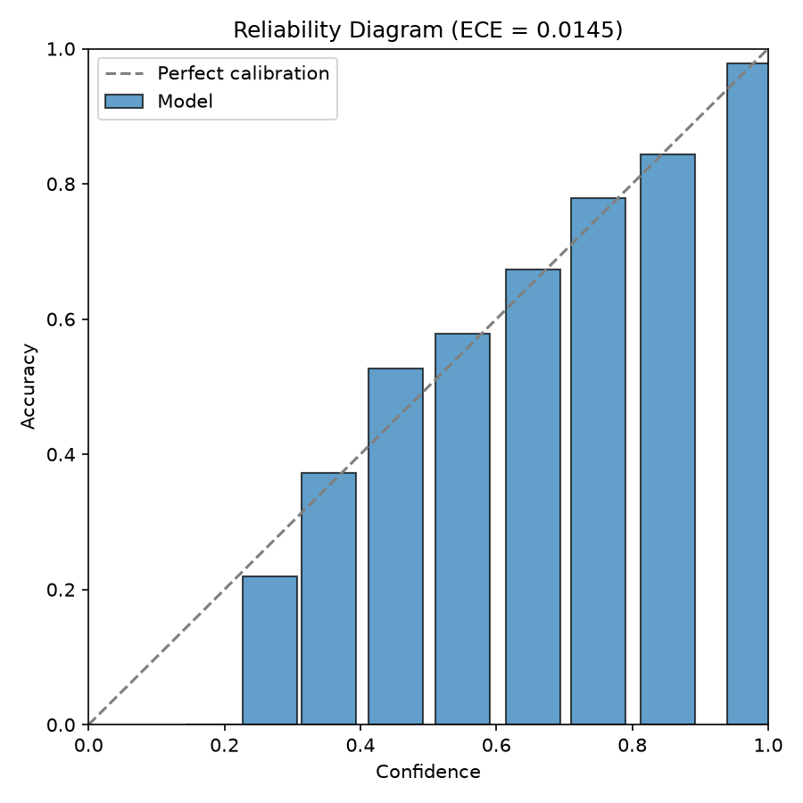
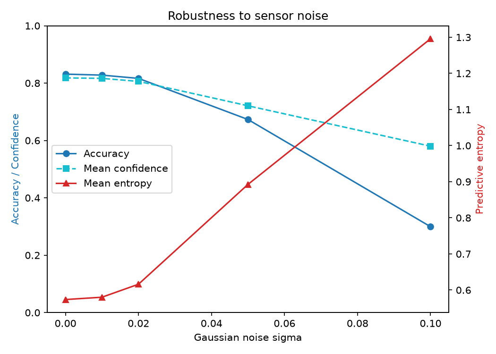
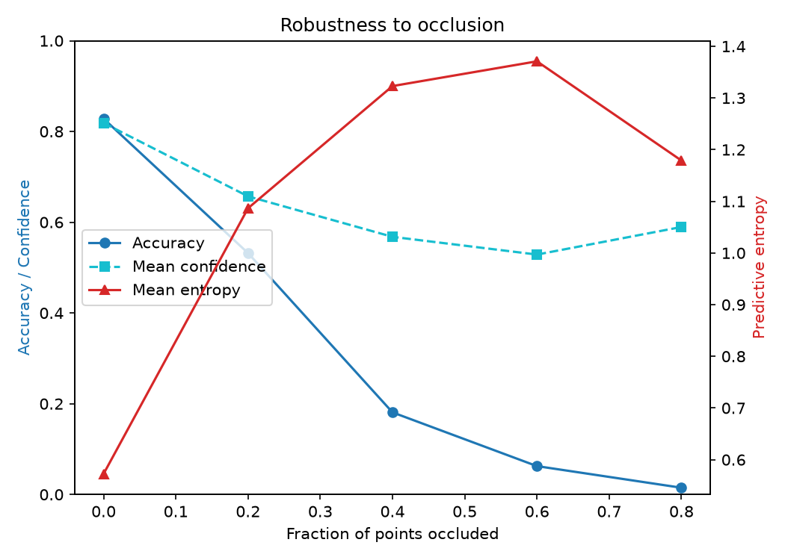
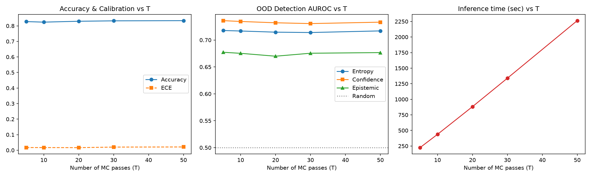

# Progress Report — Uncertainty-Aware PointNet

*(work in progress, last updated after the dropout-rate ablation on Sep 3, 2026)*

## Objective

Point clouds are just a bunch of `(x, y, z)` points floating in space — no order, no grid, that's how a LiDAR/depth sensor actually sees the world. PointNet (the model this whole project is built on, from a 2017 paper) is good at classifying what object a point cloud represents. But it has one big problem: it always answers. Feed it a noisy scan, a half-visible object, or something it's never seen before, and it'll still confidently spit out a class — it has no way of saying "I'm not sure."

That's the actual question this project is trying to answer:

> **Can we make PointNet tell us when its own prediction shouldn't be trusted — using Monte Carlo Dropout — so a robot can make a safe grasping decision instead of confidently acting on a wrong guess?**

We're not trying to beat PointNet's accuracy. We're trying to give it a working "I don't know" button.

---

## Dataset

**Source →** ModelNet40 — a collection of 40 categories of 3D objects, already converted to point clouds. Same dataset the original PointNet paper used, so our numbers are directly comparable to theirs.

It only ships with train/test splits, so we carved 10% out of the training data ourselves to get a proper validation set. We also picked 5 object classes and completely hid them from training — these become our **OOD set** (out-of-distribution — object types the model has literally never seen, used later to test whether it gets appropriately unsure around unfamiliar things).

| Split | Count |
|---|---|
| Train | 8,163 objects |
| Validation | 905 objects |
| Test | 2,288 objects |
| OOD (held out entirely) | 180 objects |

**Held-out classes:** `bottle`, `bowl`, `cup`, `keyboard`, `laptop` — chosen because they're realistic things a robot might actually try to grasp, and they cover pretty different shapes (round/hollow, flat, irregular).

---

## Model architecture

We didn't need to change the architecture at all — just how we *use* it at prediction time. The model is the original PointNet classification network:

```
Point cloud (N x 3)
  → Input alignment network (a small sub-network that "straightens out" the object's orientation)
  → shared per-point feature extraction
  → Feature alignment network (same idea, on the internal features this time)
  → shared per-point feature extraction (up to 1024 dimensions)
  → symmetric max-pooling  →  a single vector describing the whole object
  → a couple of fully-connected layers with dropout
  → softmax → class probabilities
```

*(quick note on "symmetric max-pooling": this is the actual trick that makes PointNet work on unordered points in the first place — since max() doesn't care what order you feed numbers into it, the model ends up not caring what order the points come in either. That's what lets it handle a "bag of points" instead of needing a grid like a normal image CNN.)*

**Total trainable parameters:** 3.47 million — matches the ~3.5M the original paper reports, which told us we'd implemented it faithfully and not accidentally built a weaker toy version.

**Loss:** cross-entropy + a small regularization term (0.001 × orthogonality penalty on the feature-alignment network, keeps that alignment step behaving like a proper rotation instead of squashing information).

**The one actual change we made:** dropout layers normally get switched *off* once training ends. We keep them *on* during inference too — that's the whole trick behind Monte Carlo Dropout, more on this below.

---

## Baseline training

- **Setup:** 100 epochs, Adam optimizer (lr=1e-3, weight decay=1e-4), learning rate halved every 20 epochs, batch size 32.
- **Convergence:** validation accuracy got within 1% of its best value by epoch 61 — so most of the learning happened in the first two-thirds of training.

| Metric | Value |
|---|---|
| Best validation accuracy | 86.08% |
| Test accuracy | 82.82% |
| Test macro precision / recall / F1 | 0.740 / 0.748 / 0.739 |

The original paper reports ~89% on the full 40-class dataset — we're on a 35-class version (5 held out for OOD) with no hyperparameter tuning, so 82.8% is a solid, credible match, not a red flag.

One thing worth noting: accuracy (0.83) and macro-F1 (0.74) don't quite agree — that gap usually means a few classes (probably ones with fewer training examples) are dragging the average down while the well-represented classes carry the accuracy number. Haven't broken this down per-class yet.

---

## Monte Carlo Dropout — how we actually measure uncertainty

**Method →** T=30 stochastic forward passes per sample at inference time (dropout stays active, BatchNorm stays frozen to its running stats). This follows Gal & Ghahramani's (2016) idea that leaving dropout on at test time and averaging over repeated passes approximates a proper Bayesian model, without the massive cost a real Bayesian neural network would need.

Concretely: we run the *same* point cloud through the network 30 times. Because dropout randomly turns off different neurons each pass, each of the 30 runs is like asking a slightly different version of the model. If they mostly agree, the model's confident. If they scatter all over the place, it isn't.

From those 30 outputs, we compute:

- **Mean prediction** — just the average of the 30 softmax outputs. This is what we actually use as "the" prediction.
- **Total predictive entropy (H)** — how spread out the *averaged* prediction is. Higher = more uncertain overall.
- **Aleatoric uncertainty** — the average uncertainty of each *individual* pass. This captures uncertainty baked into the input itself (genuinely ambiguous data) — more passes won't fix this, the data itself is just unclear.
- **Epistemic uncertainty** — total entropy minus aleatoric. This captures the model's *own* ignorance — how much the 30 passes disagree with each other. In theory, this is the part that should spike hard on objects the model's never seen (if every pass agreed perfectly, this would be exactly 0).

---

## Calibration & OOD detection

Two real questions here: **(1)** does the model's confidence number actually mean anything (calibration), and **(2)** can we use its uncertainty to catch objects it's never seen (OOD detection)?

**Calibration → ECE (Expected Calibration Error) = 0.0145.** This measures the gap between "how confident the model says it is" and "how often it's actually right" — lower is better, and anything under ~0.05 is generally considered well-calibrated. Our number's well within that. In plain terms: when this model says it's 90% sure, it's actually right about 90% of the time. That's genuinely good news, and not something you get for free — plenty of neural nets are overconfident by default.



**OOD detection → AUROC** (how well can we separate "seen before" objects from "never seen before" objects, just by looking at how uncertain the model is — 0.5 = random guessing, 1.0 = perfect separation):

| Signal used | AUROC |
|---|---|
| Confidence | **0.729** |
| Aleatoric | 0.714 |
| Total entropy | 0.713 |
| Epistemic | 0.674 |

Interesting (and slightly unexpected) result: plain old confidence — not the fancier epistemic signal — turned out to be the *best* at spotting unseen objects. Epistemic uncertainty, the one Bayesian theory says should be the "gold standard" ignorance signal, was actually the weakest of the four. That became the whole motivation for the next experiment.

---

## Robustness to noise and occlusion

We simulated two realistic ways a real sensor scan goes wrong, and checked whether the model's confidence *honestly* drops along with its accuracy, or stays falsely high.

**Noise** (jittering point coordinates by increasing amounts):



Confidence tracked accuracy closely under mild-to-moderate noise, and only really diverged (model staying more confident than it should be) once noise got severe.

**Occlusion** (simulating a scan that only sees part of the object, like a single-viewpoint LiDAR scan):



This one's the important finding. By 60-80% occlusion, accuracy had collapsed to near-zero, but the model's confidence stayed sitting around 55-60% the whole time. In plain terms: **when the scan is badly incomplete, the model doesn't get appropriately unsure — it just keeps guessing confidently, and it's usually wrong.** This is exactly the failure mode we set out to catch in the first place, now actually demonstrated with real numbers instead of just theorized about.

---

## Ablation #1 — how many MC passes do we actually need?

We'd been using T=30 passes somewhat arbitrarily. So we tested T = 5, 10, 20, 30, 50 on the same trained model (no retraining needed — this only changes how many times we run inference, not the model itself).



**Result: barely any difference.** Accuracy, calibration, and OOD-detection AUROC were all nearly identical whether we used 5 passes or 50 — while the compute time scaled up linearly (10x the passes = roughly 10x the time, no surprise there, but no payoff for it either). So T=5 gets you basically the same quality as T=30 for a fraction of the cost. Useful to know for anything that needs to run this repeatedly.

---

## Ablation #2 — does the dropout rate matter?

This is the big one. The original run used dropout=0.3. We retrained the exact same model at four different dropout rates (0.1, 0.3, 0.5, 0.7 — each 100 epochs) to see if a different rate would fix that weak epistemic-uncertainty result from earlier.

*(quick reminder: "dropout rate" is just what fraction of neurons get randomly turned off each pass — e.g. 0.3 means 30% of neurons get zeroed out on any given forward pass. Higher rate = more randomness injected per pass.)*

| Dropout rate | Test accuracy | ECE | AUROC (confidence) | AUROC (epistemic) |
|---|---|---|---|---|
| 0.1 | **0.844** | 0.030 | **0.735** | **0.705** |
| 0.3 (original) | 0.828 | **0.0145** | 0.729 | 0.674 |
| 0.5 | 0.816 | 0.016 | 0.678 | 0.665 |
| 0.7 | 0.808 | 0.017 | 0.673 | 0.626 |

**This did NOT go the way we expected.** The hypothesis going in was: more dropout → more disagreement between the 30 passes → a stronger, more useful epistemic signal. What actually happened is the opposite — every single uncertainty signal got *worse* at telling seen from unseen objects as dropout went up, and accuracy dropped too. Epistemic uncertainty specifically got weaker and weaker the more dropout we added (0.705 → 0.626).

The one real trade-off: dropout=0.1 wins on accuracy and OOD-detection, but its calibration is noticeably worse (0.030 vs ~0.015 for the others) — still fine by normal standards, just not as tight.

So — this ablation's honest conclusion is a bit of a "well, that's not what we thought would happen" result. Which is fine, that's still a real finding worth reporting: **more dropout doesn't buy you a better ignorance signal here, it just costs you accuracy.**

---

## What's still left to do

- [ ] Look into whether dropout=0.1 should become the "real" model going forward, given it wins on both accuracy and OOD detection.
- [ ] Build the actual confidence-gated decision policy (Grasp / Re-scan / Ask-help), with thresholds picked properly from the data instead of guessed.
- [ ] Figure out what's going on with the entropy dip at 80% occlusion (see occlusion plot above — small non-monotonic wobble, probably means something, haven't dug into it yet).
- [ ] ROS2 + simulated grasping demo (the "make it real" application layer — planned as the last piece).

---

## Repo layout (quick map)

```
src/
├── data/          # dataset loading + noise/occlusion corruption
├── models/        # PointNet backbone + MC Dropout inference mode
├── training/       # training script
├── inference/      # MC Dropout inference (per-sample uncertainty)
├── evaluation/      # calibration, OOD-AUROC, corruption sweeps, ablations
└── utils/          # experiment logging, shared config (OOD classes, seeds, etc.)

experiments/        # one folder per training run — config, checkpoints, metrics, plots
data/               # downloaded ModelNet40 (not tracked in git, re-downloadable via script)
```
